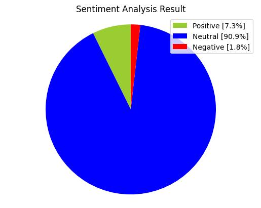

# da-python-tweet_webscrapper

## :wave: Welcome

A data analysis project that utilizes the Python programming language to scrape tweets from twitter and perform data analysis on them. The project aims to provide insights into Twitter data by collecting tweets, analyzing their content, and visualizing the results.

## 💻 Description

The project uses web scraping techniques to collect tweets from twitter. The collected tweets are then stored in a dataframe using the Pandas library.

Once the tweets have been collected, the project performs data analysis on them. This includes tasks such as cleaning the data, removing irrelevant information and converting data types. The project also uses Natural Language Processing (NLP) techniques to extract insights from the tweets, such as sentiment analysis, topic modeling and other NLP techniques

Finally, the project visualizes the results using libraries such as Matplotlib and Seaborn to create plots, charts and other visualizations. This allows for an easy and intuitive understanding of the insights obtained from the data.

## Preview

